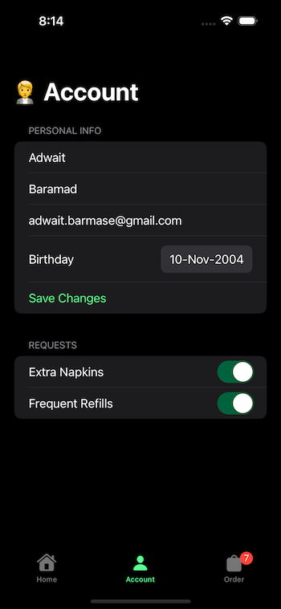
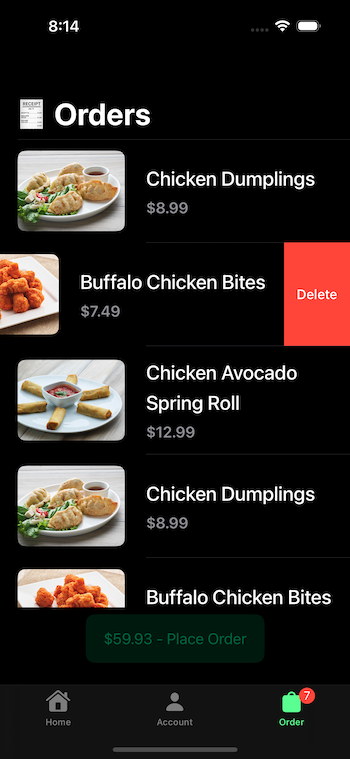

## AppetizersApp

### An Online Order App with Food Lists, Orders, Order Details, Account
- [x] SwiftUI
- [x] List ScrollView
- [x] Details Overlay
- [x] Async/Await Network calls
- [x] AsyncImage to fetch image from url
- [x] Handled Custom Alerts/Errors
- [x] @AppStorage to store data
- [x] Cache store for images
- [x] @ObservableObject viewmodels
- [x] Used @FocusState and .onSubmit to optimise UX while using keyboard
- [x] Use of UIKit Components for loading view

#### The Appetizer Screen:

---

#### The Account Screen:

---

#### The Orders Screen:

---
